<p align="center"></p>

<h1 align="center">Basquin</h1>

**Kubernetes-native fuzz and load testing for JVM web apps — where the bug oracle is availability,
not just crashes.**

Instrument an *unmodified* app with a `BasquinTarget`, run a coverage-guided fuzz campaign to
discover the inputs that stress it, then replay those exact inputs under load. Latency spikes, heap
retention, and thread/executor leaks are first-class findings — not just exceptions.

[](https://github.com/ianp94/basquin/actions/workflows/ci.yml)
[](https://github.com/ianp94/basquin/actions/workflows/operator-e2e.yml)
[](https://github.com/ianp94/basquin/releases/latest)

📖 **[Documentation, guides & demos → ianp94.github.io/basquin](https://ianp94.github.io/basquin/)**
· 🚀 **[Releases & live status](https://ianp94.github.io/basquin/releases.html)**
· 📝 **[Changelog](CHANGELOG.md)** (release-level, linking each component's own)



*Above: 250 requests against an unmodified [JPetStore](https://github.com/mybatis/jpetstore-6) pod —
live **coverage %** (281/6368 edges of the pod's own code, pulled from its JaCoCo agent), **96
invariant finds** harvested server-side through the valve, 0 crashes.*

## Built with AI assistance

Much of Basquin's code and documentation was written by Anthropic's Claude (via Claude Code),
with the author directing the design, making the architecture and semantic decisions, and reviewing
the work. This is noted for transparency — the project is not presented as entirely hand-written.

## The model: instrument once, then run campaigns

Two custom resources in group `basquin.dev/v1alpha1`:

- **`BasquinTarget`** — *instrument a Deployment.* Long-lived. Patches an unmodified app
  Deployment to load the agents (thread tracker, JaCoCo coverage) via an initContainer + shared
  volume. Fully reversible — deleting it restores the Deployment byte-for-byte.
- **`BasquinCampaign`** — *run a bounded test.* Ephemeral. Drives the instrumented target and
  aggregates results into status. One target, many campaigns over time.

Campaigns run in one of two **modes**:

| Mode | What it does | Bounded by |
|------|--------------|------------|
| `explore` (default) | Coverage-guided fuzzing — mutates requests, keeps inputs that reach new code, and emits the interesting ones as a corpus ConfigMap | `iterations` or `duration` |
| `load` | Replays a saved corpus at a fixed concurrency, reporting throughput and latency percentiles | `duration` |

*Fuzz to discover the interesting states, then hammer those states under load.*

The operator is **namespaced by design**: it watches and mutates only its own namespace and refuses
to start cluster-wide. The standing privilege is a `Role`/`RoleBinding`, never a `ClusterRole`.

## Quick start (Kubernetes)

Install the operator from the published Helm repo — real images from ghcr, nothing to build:

```bash
helm repo add basquin https://ianp94.github.io/basquin/charts
helm repo update
helm install basquin basquin/basquin-operator \
  --namespace basquin-system --create-namespace --set fullnameOverride=basquin
```

Then drive it with the `basquin` CLI. Install it any of these ways:

```bash
# a) Download a release binary — linux/macOS/Windows × amd64/arm64.
#    Swap the suffix for your platform: basquin-{linux,darwin,windows}-{amd64,arm64}(.exe)
curl -sSL -o basquin https://github.com/ianp94/basquin/releases/latest/download/basquin-linux-amd64
chmod +x basquin && sudo mv basquin /usr/local/bin/basquin
#    (each release also ships checksums.txt to verify against)

# b) go install — pure Go, nothing to package.
go install github.com/ianp94/basquin/operator/cmd/basquin@latest
```

Snap packaging (Ubuntu) is planned — see `TODO.md`. Once installed:

```bash
# 1. Instrument a running app — no rebuild, no image changes.
basquin instrument -n basquin-system --deployment jpetstore \
  --jvm-opts-var CATALINA_OPTS --coverage-includes 'org.mybatis.jpetstore.*' --coverage-service --wait

# 2. Fuzz it: coverage-guided exploration, emitting a corpus of interesting inputs.
basquin run -n basquin-system --target jpetstore \
  --base-url http://jpetstore-app.basquin-system.svc.cluster.local:8080 \
  --iterations 500 --grammar examples/grammar/jpetstore.grammar \
  --corpus examples/corpus/jpetstore --watch

# 3. Replay what it found, under load.
basquin run -n basquin-system --name jpetstore-load --mode load --target jpetstore \
  --base-url http://jpetstore-app.basquin-system.svc.cluster.local:8080 \
  --duration 30m --concurrency 50 --corpus ./saved-corpus --watch

# 4. Read results / open the per-campaign dashboard.
basquin status -n basquin-system
basquin dashboard -n basquin-system --campaign jpetstore-campaign   # then open :7070
```

Everything above is also plain YAML if you prefer — see
**[OPERATOR-USAGE](docs/OPERATOR-USAGE.md)**, the task-oriented guide. The canonical, always-working
reference is [`deploy/e2e/e2e.sh`](deploy/e2e/e2e.sh), which runs the entire flow (build → install →
instrument → fuzz → load → dashboard) in an ephemeral kind cluster on every CI change.

## Why it's different

Fuzzers like Jazzer and JQF are excellent, but their oracle is "did it throw / crash." Load tools
like k6 and Gatling measure throughput but know nothing about what's happening *inside* the JVM.
Basquin sits in the gap:

- **Availability is the oracle.** An input is *interesting* if it exceeds a latency budget, grows
  the heap, or leaks a thread/executor — not only if it throws. Most JVM web apps don't fall over
  with a `NullPointerException`; they degrade.
- **Iteration cleanliness is enforced, not assumed.** Each iteration runs inside strict begin/end
  boundaries; leaked non-daemon threads and un-shut executors are detected and reported with stacks.
- **It works on apps you can't change.** The operator instruments an unmodified image at deploy
  time; a Tomcat valve wraps every request of an unmodified third-party WAR — one namespace-free jar
  for both Tomcat 9 (`javax`) and 10+ (`jakarta`).
- **The corpus carries over.** The inputs fuzzing found interesting become the load test's workload,
  so you're loading the paths that actually stress the app, not a hand-written happy path.

## What it found in JPetStore (unmodified)

Running inside JPetStore's JVM, with no changes to the app:

| Signal | Example |
|--------|---------|
| Latency spike | cold first-catalog request **531ms** (budget 20ms) |
| Heap growth | up to **44MB** allocated on a single request |
| Per-request cost | steady multi-hundred-KB retention across catalog routes |

These are exactly the input/state-dependent availability pathologies the project targets.
Full walkthrough: [THIRD-PARTY-APPS](docs/THIRD-PARTY-APPS.md).

## How exploration works


*Above: exploring an unmodified JPetStore over HTTP — 220 requests, **0 crashes** (it's robust),
**48 invariant finds** harvested server-side via the valve.*

**Coverage comes from the app under test.** A JaCoCo agent runs in the target's JVM and the driver
reads it over the wire, so the coverage % is a real "% of code explored" rather than anything
measured in the harness. Coverage-*guided* mutation then keeps the inputs that reach new code.

**The reachable surface is data, not code.** A [request grammar](docs/USAGE.md#writing-a-request-grammar)
supplies route templates, the corpus supplies parameter values, and `~EST-[0-9]{1,4}`-style
structural generation invents ids that *parse but don't exist* — which is how the deepest crashes
were found. `@sequence` blocks run ordered, session-carrying transactions (sign on → add to cart →
check out) to reach code a single request never can.

**Crashes are real crashes.** A target declares its expected input rejections via `CrashClassifier`,
so a parser throwing `IllegalArgumentException("bad char")` is counted as *rejected*, not a crash —
only genuine faults (an unhandled `NoSuchElementException`, an `NPE`, a 5xx) count.

## Load mode

A `load` campaign replays a corpus — usually the one an `explore` run emitted — at a fixed
concurrency for a duration, reporting into `status.load`:

```json
{"requests":1284003,"throughputRps":"713.4","latencyMs":{"p50":8,"p90":22,"p99":61,"max":240},
 "heapDriftKb":1840,"threadDrift":0,"violations":{"latency":12,"heap":0,"thread":0}}
```

Latency is threshold-gated against the campaign's invariants; heap and threads are reported as
end-to-end **drift**. A load run's driver is coverage-free (no JaCoCo, no class extraction).
Design note: [LOAD-MODE-DESIGN](docs/LOAD-MODE-DESIGN.md) (DD-026).

## Web dashboard

A **standalone** dashboard process — never embedded in a driver, never near the app under test. The
operator runs one per campaign and points the driver at it; drivers push status and findings keyed
by campaign id. The page shows a fleet view of every reporting campaign, with drill-down into metric
cards, a coverage bar, and a findings table (route/detail/classification, not just counts).

It binds **127.0.0.1** by default and guards its ingest/analyze endpoints, since the analysis
endpoint spends API credit — see [DD-013](docs/DESIGN-DECISIONS.md) for the decoupling and
[DD-022](docs/DESIGN-DECISIONS.md) for the trust boundary.

## Running it without Kubernetes

The operator is the product, but the harness underneath runs standalone — useful for local
development, for CI on a non-Kubernetes runner, or for driving an app you haven't containerized:

```bash
./gradlew build

# See a deliberate thread leak get caught (fails on purpose):
./gradlew runRunnerLeak

# Prove stability over 10,000 clean iterations:
./gradlew runSoakProper

# Drive a running web app and watch the live status screen:
./gradlew runHttpDrive -Dexamples.http.baseUrl=http://localhost:8080 \
  -Dbasquin.invariant.latency.maxMs=50 -Dbasquin.invariant.mode=soft
```


Point it at **your** app by implementing a three-method `IterationTarget` — see
[USAGE](docs/USAGE.md#use-with-your-app). Every flag is documented in [USAGE](docs/USAGE.md).

## How it works underneath

```
Inputs → Runner (begin/end iteration) → App entry → Metrics & invariants → Reset → repeat
```

- **Runner** executes iterations within boundaries and orchestrates the checks.
- **Agent** measures each iteration (latency, heap delta, thread/executor leaks) and evaluates
  invariants; an optional **JVMTI native agent** tracks thread lifecycle via events (no polling, no
  safepoint stack walks), with a `ThreadMXBean` fallback.
- **Reset** prefers enforced cleanliness, falling back to a classloader swap.
- **Triage** saves interesting inputs with classification, stacks, and metrics — off the hot path.

Details and the "why" behind each choice: [ARCHITECTURE](docs/ARCHITECTURE.md) ·
[DESIGN-DECISIONS](docs/DESIGN-DECISIONS.md).

## Features

- **Kubernetes operator**: two CRDs, namespaced RBAC, reversible in-place instrumentation of
  unmodified app images, per-campaign dashboards, published multi-arch images
- **Two campaign modes**: coverage-guided fuzzing (`explore`) and corpus replay under load (`load`),
  with the corpus carrying from one to the other
- **`basquin` CLI**: instrument / run / status / dashboard, for linux, macOS, and Windows
- **Helm chart** published to a GitHub Pages Helm repo; images on ghcr.io
- Availability invariants (latency / heap / thread-delta) with hard-fail or soft-signal modes
- Thread, executor, and timer leak detection with stack evidence, via a JVMTI native agent
- **Coverage of the app under test**, read from its JaCoCo agent over the wire — and used to guide
  mutation
- **Grammar-driven exploration**: routes and value structure as data, with multi-step
  session-carrying transactions
- Crash findings carry the **app's** stack, not the harness's; findings clustered by fingerprint
- Tomcat valve for unmodified third-party WARs — one jar for `javax` and `jakarta`
- Standalone web dashboard with optional Claude-backed analysis; AFL-style live status screen

## Etymology

**Basquin** · /ˈbæs.kɪn/ · *BAS-kin*

Named for **Olin Hanson Basquin**, whose 1910 paper *The Exponential Law of Endurance Tests* gave
materials science **Basquin's law** — the relationship between the stress placed on a material and
the number of load cycles it survives before it fatigues and fails (`σ_a = σ'_f · (2·N_f)^b`, the shape
of the S–N curve).

Basquin measured metal. Basquin measures your JVM: it applies cyclic stress — load and fuzz — and
watches for the point where *availability* fatigues, when latency, heap, and threads stop holding
under repetition. Same curve, different material.

## Docs

- [OPERATOR-USAGE](docs/OPERATOR-USAGE.md) — **start here for Kubernetes**: instrument an app, run
  explore/load campaigns, read results. Install via the
  [Helm chart](deploy/helm/basquin-operator/README.md) or the `basquin` CLI
- [USAGE](docs/USAGE.md) — the standalone harness: commands, flags, grammar, every runnable task
- [OPERATOR-DESIGN](docs/OPERATOR-DESIGN.md) · [CAMPAIGN-DESIGN](docs/CAMPAIGN-DESIGN.md) (DD-025) ·
  [LOAD-MODE-DESIGN](docs/LOAD-MODE-DESIGN.md) (DD-026) — operator, campaign, and load/soak design
- [ARCHITECTURE](docs/ARCHITECTURE.md) — how and why
- [DESIGN-DECISIONS](docs/DESIGN-DECISIONS.md) — decision log with rejected alternatives
- [BENCH-AB](docs/BENCH-AB.md) — pheromone selection (DD-032) bench "prove or kill" protocol
- [THIRD-PARTY-APPS](docs/THIRD-PARTY-APPS.md) — running against unmodified WARs (JPetStore)
- [deploy/k8s](deploy/k8s/README.md) — the pre-operator kind demo
- [TODO](TODO.md) — roadmap and milestones
