# ClosureJVM

**Find the availability bugs that crash-only testing misses — in real JVM web apps, unmodified.**

Most JVM web apps don't fall over because of a `NullPointerException`. They degrade: a
pathological input takes 500ms instead of 5ms, a request leaks a thread or holds an executor,
memory creeps across requests until a GC storm. These failures are input- and state-dependent,
hard to reproduce, and invisible to tests that only check for exceptions. ClosureJVM runs an app
across thousands of clean iterations and treats **availability invariants** — latency, heap
retention, thread/executor leaks — as first-class bug oracles, not just crashes.

[](https://github.com/ianp94/closureJVM/actions/workflows/ci.yml)



*Above: the live status screen during a 200-iteration HTTP drive against an unmodified
[JPetStore](https://github.com/mybatis/jpetstore-6), flagging the app's real per-request latency.*

## Why it exists

Fuzzers like Jazzer and JQF are excellent, but their oracle is "did it throw / crash." The gap
ClosureJVM fills:

- **Availability is the oracle.** An iteration is *interesting* if it exceeds a latency budget,
  grows the heap, or leaks a thread/executor — not only if it throws.
- **Iteration cleanliness is enforced, not assumed.** Each iteration runs inside strict
  begin/end boundaries; leaked non-daemon threads and un-shut executors are detected and reported
  with stacks. Contamination becomes obvious instead of mysterious.
- **It works on apps you can't change.** A Tomcat valve wraps every request of an *unmodified*
  third-party WAR — no code edits, no repackaging — and a single namespace-free jar runs on both
  Tomcat 9 (`javax`) and Tomcat 10+ (`jakarta`).

## What it found in JPetStore (unmodified)

Running inside JPetStore's JVM via the valve, with no changes to the app:

| Signal | Example |
|--------|---------|
| Latency spike | cold first-catalog request **531ms** (budget 20ms) |
| Heap growth | up to **44MB** allocated on a single request |
| Per-request cost | steady multi-hundred-KB retention across catalog routes |

These are exactly the input/state-dependent availability pathologies the project targets.
Full walkthrough: [THIRD-PARTY-APPS](docs/THIRD-PARTY-APPS.md).

## Quick start

```bash
./gradlew build

# See a deliberate thread leak get caught (fails on purpose):
./gradlew runRunnerLeak

# Prove stability over 10,000 clean iterations:
./gradlew runSoakProper

# Drive a running web app and watch the live status screen:
./gradlew runHttpDrive -Dexamples.http.baseUrl=http://localhost:8080 \
  -Dclosurejvm.invariant.latency.maxMs=50 -Dclosurejvm.invariant.mode=soft
```

Point it at **your** app by implementing a three-method `IterationTarget` — see
[USAGE](docs/USAGE.md#use-with-your-app).

## How it works

```
Inputs → Runner (begin/end iteration) → App entry → Metrics & invariants → Reset → repeat
```

- **Runner** executes iterations within boundaries and orchestrates the checks.
- **Agent** measures each iteration (latency, heap delta, thread/executor leaks) and evaluates
  invariants; an optional **JVMTI native agent** tracks thread lifecycle via events (no polling,
  no safepoint stack walks), with a `ThreadMXBean` fallback.
- **Reset** prefers enforced cleanliness, falling back to a classloader swap.
- **Triage** saves interesting inputs with classification, stacks, and metrics — off the hot path.

Details and the "why" behind each choice: [ARCHITECTURE](docs/ARCHITECTURE.md) ·
[DESIGN-DECISIONS](docs/DESIGN-DECISIONS.md).

## Exploration

Coverage-guided fuzzing (JQF) runs each input through the same iteration boundaries and
invariants, and the live status screen grows an **exploration panel** as a campaign progresses —
execs/sec, corpus size, finds by classification (crash / invariant), and time-since-last-find.



```bash
./gradlew runFuzzCalculatorJQF -DenableJQF=true -Dclosurejvm.status=true
```

*Next (v0.10): coverage-guided over HTTP — a server-side coverage agent feeds the app-under-test's
per-request coverage back to the client fuzzer. See [TODO](TODO.md).*

## Features

- Availability invariants (latency / heap / thread-delta) with hard-fail or soft-signal modes
- Thread, executor, and timer leak detection with stack evidence
- Event-driven thread tracking via a JVMTI native agent (one jar, JDK 17 & 21)
- Coverage-guided exploration (JQF), corpus replay, and ddmin minimization
- Tomcat valve for unmodified third-party WARs — one jar for `javax` and `jakarta`
- Live AFL-style status screen for long runs

## Docs

- [USAGE](docs/USAGE.md) — commands, flags, and every runnable task
- [ARCHITECTURE](docs/ARCHITECTURE.md) — how and why
- [DESIGN-DECISIONS](docs/DESIGN-DECISIONS.md) — decision log with rejected alternatives
- [THIRD-PARTY-APPS](docs/THIRD-PARTY-APPS.md) — running against unmodified WARs (JPetStore)
- [TODO](TODO.md) — roadmap and milestones · [agents.md](agents.md) — maintainer guardrails
